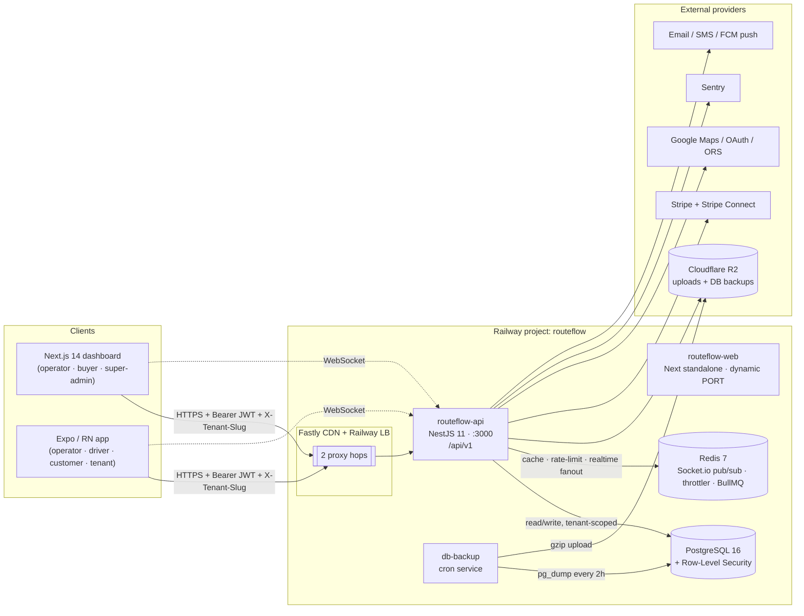
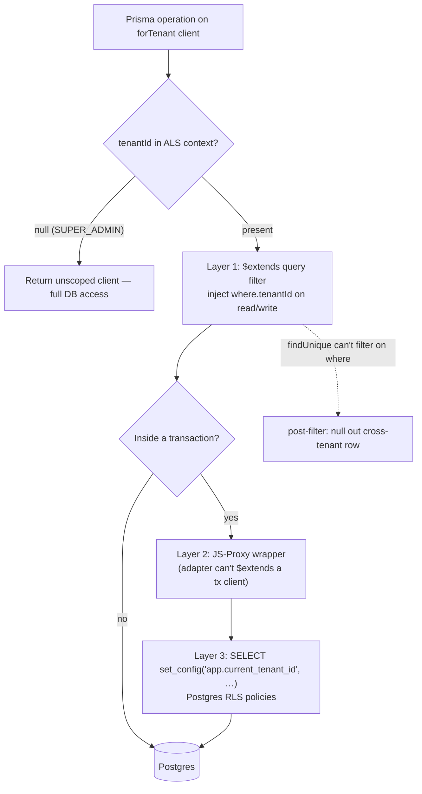
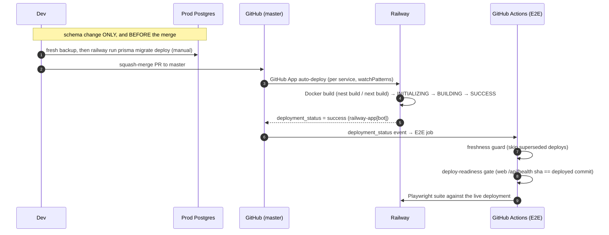
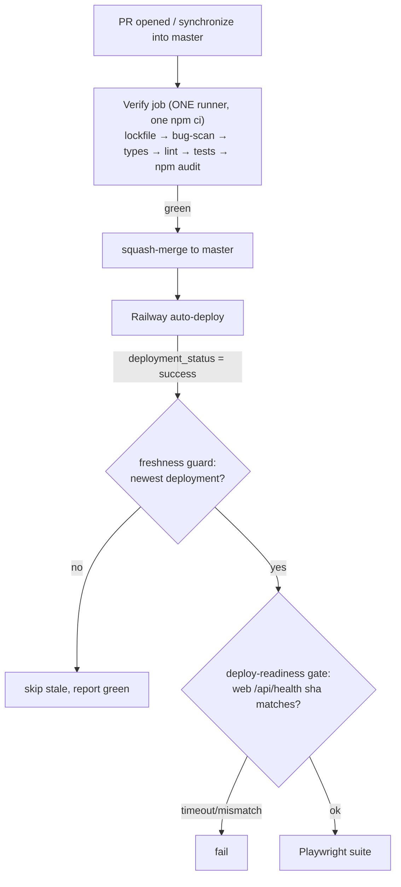

# RouteFlow — Technical Architecture, Deployment & SDLC

> Reverse-engineered from the `routeflow` monorepo @ `d4f85fd2` (branch `master`) on 2026-09-02.
> Read-only analysis. Every behavioural claim is cited `file:line`; inferences are marked **(inferred)**.

## TL;DR

- **What it is:** a multi-tenant delivery / route-management SaaS — a NestJS REST+WebSocket API, a Next.js 14 operator/buyer dashboard, and an Expo (React Native) multi-role mobile app, in one **npm-workspaces + Turbo** monorepo, deployed to **Railway** as per-app Docker containers.
- **The spine of the whole system is tenant isolation.** Every row is tenant-scoped and enforced in _three_ layers inside [`prisma.service.ts`](../apps/api/src/prisma/prisma.service.ts): a Prisma `$extends` query filter, a JS-Proxy transaction wrapper, and a Postgres RLS session variable.
- **Auth** is JWT (access + rotating refresh), issued per tenant, carrying `tenantId`/`role`/entitlement claims; the tenant for an _anonymous_ request comes from a header/subdomain, for an _authenticated_ one from the JWT claim ([`auth.service.ts:136`](../apps/api/src/auth/auth.service.ts), [`tenant.interceptor.ts:15`](../apps/api/src/tenant/tenant.interceptor.ts)).
- **Deployment is deliberately dumb and safe:** Railway auto-deploys `master` via Docker; the container `CMD` is only `node dist/main.js` and **never migrates** — schema changes are applied manually and _before_ the merge.
- **The SDLC is the most unusual part of this repo.** The authoritative quality gate is a local `npm run verify` git pre-push hook; CI is one thin Linux confirmation job; E2E fires off Railway's own deploy signal; and an agent-orchestrated _"bug-register burn-down campaign"_ with a mechanical proof gate (`campaign-check.mjs`) governs what work is considered done. **The `README.md` CI/CD section is stale** — the real process is described below.

## Scope & sources

- **Subject:** the whole repository — tech stack, architecture, deployment flow, and SDLC/release process (a broad ask, so this documents the _system shape_ and traces one **representative end-to-end flow**: an authenticated, tenant-scoped API request).
- **Repository:** `routeflow` (single repo; git remote `github.com/najathakram1/routeflow`, private) — commit `d4f85fd2`.
- **In scope:** the three apps, shared packages, infra/deploy config, CI/CD workflows, git hooks, and the bespoke SDLC scaffolding under `.claude/`.
- **Out of scope:** exhaustive per-domain business logic (125 Prisma models, ~50 API modules) — the domain surface is inventoried, not traced line-by-line. Money/pricing math, invoice↔order sync, commissions, and compliance are named with pointers rather than fully reverse-engineered.

---

## Architecture at a glance



Component responsibilities in one line each:

| Component                  | Responsibility                                                                                                                                                        |
| -------------------------- | --------------------------------------------------------------------------------------------------------------------------------------------------------------------- |
| **API** (`apps/api`)       | NestJS 11 domain backend; owns all business logic, tenancy enforcement, auth, realtime. Runs from compiled `dist/main.js` ([`main.ts:226`](../apps/api/src/main.ts)). |
| **Web** (`apps/web`)       | Next.js 14 App Router dashboard; the **"golden reference"** for flows/DTOs. A client-side SPA against the API — **no BFF** (only `app/api/health`).                   |
| **Mobile** (`apps/mobile`) | Expo SDK 55 / RN 0.83 multi-role app; mirrors web's endpoints/DTOs, only the UI differs.                                                                              |
| **Packages**               | `@routeflow/types` (shared DTOs/enums), `@routeflow/ui` (tokens + iOS components), `config`/`eslint-config`/`typescript-config`.                                      |
| **Postgres**               | System of record, 125 models, RLS-backed tenant isolation.                                                                                                            |
| **Redis**                  | Socket.io cross-instance fanout, throttler storage, BullMQ queues.                                                                                                    |
| **db-backup**              | Railway cron: 2-hourly `pg_dump` → R2, monthly restore-verify.                                                                                                        |

### Tech stack

| Layer       | Choice                                                                                                                                                                               |
| ----------- | ------------------------------------------------------------------------------------------------------------------------------------------------------------------------------------ |
| Monorepo    | npm workspaces (`apps/*`,`packages/*`) + **Turbo**, npm 10.8, Node ≥18 (CI/prod pin **20**) ([`package.json`](../package.json), [`turbo.json`](../turbo.json))                       |
| API         | NestJS 11, Prisma 7 (`@prisma/adapter-pg`), PostgreSQL, Redis (`ioredis`), Passport JWT, `@nestjs/throttler`, `@nestjs/bull`, `@nestjs/schedule`, helmet, Swagger (non-prod), Sentry |
| Web         | Next.js 14 App Router, React 18, Radix + Tailwind, **TanStack Query v5** (primary data layer), react-hook-form + zod, socket.io-client, recharts, Google Maps                        |
| Mobile      | Expo 55, RN 0.83, React 19, expo-router, TanStack Query + **Zustand**, axios, socket.io-client, expo-secure-store, expo-camera/location/notifications, react-native-maps             |
| Tests       | API + mobile: **Jest** (pinned 30.2.0 via root `overrides`); web: **Playwright**                                                                                                     |
| Lint/format | ESLint flat config (per-workspace, **no root config**) + Prettier                                                                                                                    |
| Deploy      | Railway via per-app **Dockerfile** + `railway.toml`; Cloudflare R2 for objects                                                                                                       |

> **Note (inferred):** Zustand is a dependency of `apps/web` but has **zero imports** there — web state is TanStack Query + React context. Zustand is genuinely used only in `apps/mobile`.

---

## Representative end-to-end flow: an authenticated, tenant-scoped request

This is the path every domain call takes. Login is shown first (how the JWT is minted), then a subsequent authenticated read (how tenancy is enforced).

```mermaid
sequenceDiagram
    autonumber
    actor U as User (web/mobile)
    participant MW as TenantResolutionMiddleware
    participant LG as LocalAuthGuard→LocalStrategy
    participant AS as AuthService
    participant DB as Postgres
    participant JG as JwtAuthGuard→JwtStrategy
    participant TI as TenantInterceptor (ALS)
    participant SG as TenantStatus/Addon/PlanFlag guards
    participant SVC as Domain service (forTenant)

    rect rgb(235,245,255)
    note over U,DB: Login — mint JWT
    U->>MW: POST /api/v1/auth/login (X-Tenant-Slug)
    MW->>MW: resolve tenant from header/subdomain → req.resolvedTenantId
    MW->>LG: continue
    LG->>AS: validateUser(user, pass, tenantId)
    AS->>DB: find user in tenant; bcrypt.compare; lockout check
    DB-->>AS: user row
    AS->>AS: build JwtPayload {sub, role, tenantId, entitlements}
    AS->>DB: store SHA-256(refresh) row
    AS-->>U: {accessToken, refreshToken} (+ rf_refresh httpOnly cookie)
    end

    rect rgb(240,255,240)
    note over U,SVC: Authenticated read — enforce tenancy
    U->>MW: GET /api/v1/orders (Bearer JWT, X-Tenant-Slug)
    MW->>JG: (global guards run first)
    JG->>JG: verify JWT → req.user {tenantId, role}
    JG->>TI: AsyncLocalStorage.run({tenantId})
    TI->>SG: status ACTIVE? addon? plan-flag? role?
    SG->>SVC: OrdersService.findAll()
    SVC->>DB: prisma.forTenant().order.findMany()<br/>(auto-injects where.tenantId + RLS session var)
    DB-->>U: only this tenant's rows
    end
```

Numbered walkthrough:

1. **Tenant resolution (anonymous).** `TenantResolutionMiddleware.use` ([`tenant-resolution.middleware.ts:41`](../apps/api/src/tenant/tenant-resolution.middleware.ts)), registered for all routes ([`app.module.ts:189`](../apps/api/src/app.module.ts)), resolves the tenant from the `X-Tenant-Slug` header or the Host subdomain and stashes `req.resolvedTenantId`. Suspended/cancelled tenants are not resolved.
2. **Credential check.** `LocalAuthGuard` → `LocalStrategy.validate` ([`local.strategy.ts:12`](../apps/api/src/auth/strategies/local.strategy.ts)) reads that resolved tenant and calls `AuthService.validateUser` ([`auth.service.ts:45`](../apps/api/src/auth/auth.service.ts)): status/lock checks, then `bcrypt.compare`; 10 failures → 15-minute lock.
3. **Token issuance.** `AuthService.login` ([`auth.service.ts:106`](../apps/api/src/auth/auth.service.ts)) builds the `JwtPayload` (`sub`,`role`,`tenantId`,`tenantSlug`,`isAdmin`,`impersonatedBy` + entitlement claims — [`jwt-payload.interface.ts:3`](../apps/api/src/auth/jwt-payload.interface.ts)). The **access** token is signed with `JWT_SECRET`; the **refresh** token with a _separate_ `JWT_REFRESH_SECRET` and a `type:"staff"` realm discriminator, stored SHA-256-hashed ([`auth.service.ts:155`](../apps/api/src/auth/auth.service.ts)).
   - **Refresh rotation** ([`auth.service.ts:216`](../apps/api/src/auth/auth.service.ts)) rotates the row **in place** via compare-and-swap on the old hash, so session identity + `createdAt` survive (bug B155).
4. **Verify on every authenticated request.** `JwtStrategy.validate` ([`jwt.strategy.ts:19`](../apps/api/src/auth/strategies/jwt.strategy.ts)) rejects buyer-realm tokens and projects the payload onto `req.user`.
5. **Request-scoped tenant context.** `TenantInterceptor` (global `APP_INTERCEPTOR`, [`tenant.interceptor.ts:15`](../apps/api/src/tenant/tenant.interceptor.ts)) reads `req.user.tenantId` and runs the remainder of the request inside an **AsyncLocalStorage** context ([`tenant-context.service.ts:15`](../apps/api/src/tenant/tenant-context.service.ts)).
6. **Authorization gates.** `TenantStatusGuard` (blocks suspended/read-only tenants), `RolesGuard` (`@Roles`, with a role hierarchy — [`roles.guard.ts:12`](../apps/api/src/auth/guards/roles.guard.ts)), `AddonGuard` (`@RequireAddon`), and the server-authoritative `PlanFlagGuard` (`@RequirePlanFlag`, re-resolves entitlements rather than trusting the JWT claim — [`plan-flag.guard.ts:75`](../apps/api/src/billing/plan-flag.guard.ts)).
7. **Tenant-scoped data access.** Domain services call `this.prisma.forTenant()` ([`prisma.service.ts:223`](../apps/api/src/prisma/prisma.service.ts)), which auto-injects `tenantId` into every query. **SUPER_ADMIN** (null tenant) gets the unscoped client.

> ⚠️ **Load-bearing ordering subtlety:** the global guards (`ThrottlerGuard`, `TenantStatusGuard`, `ImpersonationGuard`) run _before_ the route-level `JwtAuthGuard`, so `req.user` is not yet populated when they execute — they decode the **unverified** JWT payload directly from the Authorization header ([`tenant-status.guard.ts:50`](../apps/api/src/tenant/tenant-status.guard.ts)). This is safe because they only block/log; `JwtAuthGuard` does the real verification downstream.

### The tenancy model (the system's backbone)



- **Layer 1** — `_tenantExtension` ([`prisma.service.ts:140`](../apps/api/src/prisma/prisma.service.ts)): a Prisma `$extends` that injects `where.tenantId` (reads/updates/deletes) or `data.tenantId` (creates). `findUnique` can't take `tenantId` in `where`, so its result is post-filtered to null.
- **Layer 2** — `_wrapTxWithTenant` ([`prisma.service.ts:58`](../apps/api/src/prisma/prisma.service.ts)): the `@prisma/adapter-pg` driver can't `$extends` a _transaction_ client, so a JavaScript `Proxy` re-implements the same injection for `tenantTransaction`.
- **Layer 3** — `tenantTransaction` ([`prisma.service.ts:36`](../apps/api/src/prisma/prisma.service.ts)) sets the `app.current_tenant_id` Postgres session var so **Row-Level Security** policies enforce isolation at the database, independent of the ORM. (`scripts/rls-preflight.mjs` exists to check RLS readiness.)

### Realtime

One Socket.io gateway, `RouteFlowGateway` ([`routeflow.gateway.ts:144`](../apps/api/src/gateways/routeflow.gateway.ts)): authenticates on connect via the handshake token, joins **tenant-scoped rooms** by role (`tenant:<id>:operators`, `tenant:<id>:driver:<sub>`, …), and re-broadcasts events (orders, invoices, driver location, low-stock, dispatch). The **Redis adapter** ([`redis-io.adapter.ts`](../apps/api/src/gateways/redis-io.adapter.ts), wired at [`main.ts:146`](../apps/api/src/main.ts)) fans events across all API instances, with an in-memory fallback if Redis is unreachable. Web subscribes via `lib/socket.ts` + `useRealtimeUpdates`; mobile via `hooks/useSocket.ts`, each invalidating TanStack Query keys on the matching event.

---

## Key components

| Component            | Responsibility                                                                                                                                                                                  | Location                                                                        |
| -------------------- | ----------------------------------------------------------------------------------------------------------------------------------------------------------------------------------------------- | ------------------------------------------------------------------------------- |
| API bootstrap        | secrets assert (fail-closed), `trust proxy=2`, helmet, CORS allow-list+wildcard, body-parser (rawBody for Stripe), Redis WS adapter, global `api/v1` prefix, validation pipe, exception filters | [`main.ts`](../apps/api/src/main.ts)                                            |
| PrismaService        | 3-layer tenant isolation, `forTenant()`, `tenantTransaction()`                                                                                                                                  | [`prisma.service.ts`](../apps/api/src/prisma/prisma.service.ts)                 |
| Tenant context       | request-scoped `AsyncLocalStorage` tenantId                                                                                                                                                     | [`tenant-context.service.ts`](../apps/api/src/tenant/tenant-context.service.ts) |
| AuthService          | login/refresh/reset, bcrypt, rotating refresh tokens, Google OAuth, sessions, impersonation                                                                                                     | [`auth.service.ts`](../apps/api/src/auth/auth.service.ts)                       |
| Entitlements         | plan+addon → flags/caps, 30s cache, server-authoritative                                                                                                                                        | [`entitlements.service.ts`](../apps/api/src/billing/entitlements.service.ts)    |
| Web API client       | axios + Bearer/`X-Tenant-Slug` interceptors, single-flight 401 refresh, re-auth sheet                                                                                                           | [`api-client.ts`](../apps/web/lib/api-client.ts)                                |
| Web middleware       | mobile UA proxy, presence-cookie auth redirects, tenant-slug cookie resolution                                                                                                                  | [`middleware.ts`](../apps/web/middleware.ts)                                    |
| Mobile root layout   | multi-role redirect logic (operator/driver/customer/buyer), bootstrap gate                                                                                                                      | [`app/_layout.tsx`](../apps/mobile/app/_layout.tsx)                             |
| Mobile API client    | axios, SecureStore tokens, per-role buckets, single-flight refresh, **offline mutation queue**                                                                                                  | [`api-client.ts`](../apps/mobile/lib/api-client.ts)                             |
| Pricing (×4 mirrors) | money math; kept in sync + test-pinned                                                                                                                                                          | `apps/{api/src/common,api/src/utils,web/lib,mobile/lib}/pricing.ts`             |

**API feature modules** (registered in [`app.module.ts:120`](../apps/api/src/app.module.ts)) span tenancy/identity (`auth`, `users`, `tenant(s)`, `platform-admin`), domain (`customers`, `drivers`, `products`, `orders`, `routes`, `trips`, `route-optimization`, `returns`, `inventory`, `order-templates`), finance (`invoices`, `credit-notes`, `vendor-bills`, `estimates`, `recurring-invoices`, `bookkeeping`, `billing`, `stripe-connect`, `payment-requests`, `sales-agents`/commissions), compliance (`tobacco`, `regulated`, `tracked-categories`, `authorizations`), and platform (`uploads`, `notifications`, `messages`/`messaging`, `email`, `analytics`, `audit`, `import`, `system-config`, `buyer`, `drafts`).

---

## Data & state

- **Shapes on the wire:** `class-validator` DTOs on the API; `@routeflow/types` shares enums/DTOs across all three apps; web + mobile `lib/api/*` modules are typed, per-domain TanStack Query hook sets (mobile ones are documented copies of the web DTOs, e.g. [`orders.ts:39`](../apps/mobile/lib/api/orders.ts)).
- **System of record:** PostgreSQL — **125 models / ~85 enums** in [`schema.prisma`](../apps/api/prisma/schema.prisma) (4438 lines), **24 migrations**. Core clusters: tenancy/billing (`Tenant`,`TenantConfig`,`TenantSubscription`,`TenantAddon`,`PlanDefinition`,`AddonSku`,`MeterUsage`), identity (`User`,`RefreshToken`,`Driver`,`BuyerAccount`,`CustomerLink`), sales (`Order`,`OrderItem`,`Invoice`,`InvoiceItem`,`CreditNote`,`Estimate`), procurement/inventory (`Supplier`,`PurchaseOrder`,`VendorBill`,`StockLot`,`StockMovement`), dispatch (`Route`,`RouteRun`,`RouteStop`,`Trip`-via-`Route.kind`), and compliance (`RegulatedSalesLedger`,`TobaccoReport`,`CustomerAuthorization`).
- **Client state:** web = TanStack Query (v5) + React context (single ref-stable `QueryClient`, global mutation-error toast, `staleTime` 30s — [`providers.tsx`](../apps/web/app/providers.tsx)); mobile = TanStack Query + Zustand stores (auth/tenant/buyer/cart/offline-queue/route/pod/…).
- **Client-side token storage (security-relevant):** web keeps JWTs in **localStorage** (per-role namespaced keys), explicitly documented as an MVP choice pending httpOnly migration ([`api-client.ts:4`](../apps/web/lib/api-client.ts)); mobile uses **expo-secure-store** on native / localStorage on web, with per-role buckets ([`auth.ts:11`](../apps/mobile/lib/auth.ts)). The `tenant-slug` cookie is intentionally **non-httpOnly** (client JS must read it).

---

## External dependencies & integrations

| Dependency            | How/where                                                   | Notes                                                                                                  |
| --------------------- | ----------------------------------------------------------- | ------------------------------------------------------------------------------------------------------ |
| **PostgreSQL**        | Prisma via `@prisma/adapter-pg` `Pool`                      | tenant-scoped; RLS layer                                                                               |
| **Redis**             | Socket.io adapter, throttler storage, BullMQ                | in-memory fallback for WS                                                                              |
| **Cloudflare R2**     | signed uploads (`uploads`/`storage`) + DB backups (S3 API)  | signing secret `STORAGE_URL_SIGNING_SECRET` required in prod ([`main.ts:47`](../apps/api/src/main.ts)) |
| **Stripe + Connect**  | billing + tenant merchant accounts; webhooks need `rawBody` | body-parser ordering is load-bearing ([`main.ts:143`](../apps/api/src/main.ts))                        |
| **Google**            | Maps (web/mobile), OAuth login, ORS route optimization      | `NEXT_PUBLIC_*`/`EXPO_PUBLIC_*` baked at build                                                         |
| **Sentry**            | error reporting; `SentryExceptionFilter` catch-all          | [`main.ts:185`](../apps/api/src/main.ts)                                                               |
| **Email / SMS / FCM** | notifications module; Expo push tokens on mobile            |                                                                                                        |
| **healthchecks.io**   | dead-man's switch for the backup cron                       | [`apps/db-backup/backup.sh`](../apps/db-backup/backup.sh)                                              |

---

## Configuration & environment

- **Secrets asserted at boot, fail-closed:** `JWT_SECRET` + `JWT_REFRESH_SECRET` always required; `STORAGE_URL_SIGNING_SECRET` required in production (a JWT_SECRET leak must not forge file URLs — F5-001); `ENCRYPTION_KEY` warns-not-crashes ([`main.ts:40`](../apps/api/src/main.ts)).
- **CORS:** default localhost list + `CORS_ORIGINS` allow-list + `CORS_WILDCARD_DOMAINS` subdomain patterns ([`main.ts:152`](../apps/api/src/main.ts)).
- **Feature gating:** per-tenant **addons** (`@RequireAddon`) and **plan flags** (`@RequirePlanFlag`, with a `PLAN_FLAG_ENFORCEMENT` dark-launch kill switch), plus a `developer_mode` addon for in-dev surfaces.
- **Env files (names only, never committed):** [`apps/api/.env.example`](../apps/api/.env.example), [`apps/web/.env.example`](../apps/web/.env.example), [`apps/mobile/.env.example`](../apps/mobile/.env.example). `NEXT_PUBLIC_*`/`EXPO_PUBLIC_*` are inlined at build time.
- **Startup DDL safety-net:** [`main.ts:69`](../apps/api/src/main.ts) runs idempotent `ALTER TABLE … ADD COLUMN IF NOT EXISTS` before boot, gated by `RUN_STARTUP_DDL` (defaults on) — a deliberate, acknowledged exception to the never-auto-migrate rule for columns not yet covered by a Prisma migration (F12-002).

---

## Failure modes & error handling

- **Global exception filters, order is load-bearing** (Nest checks them in reverse registration order): `SentryExceptionFilter` (catch-all, scores 5xx) → `ThrottlerExceptionFilter` (429 + `Retry-After`) → `MulterExceptionFilter` (maps multer 2.3 codes to 400) ([`main.ts:185`](../apps/api/src/main.ts)).
- **Rate limiting:** 100 req/60s per IP globally (Redis-backed), with tighter per-route throttles on auth endpoints; `trust proxy=2` is required or per-IP limiting is defeated by Fastly's rotating edge IPs ([`main.ts:129`](../apps/api/src/main.ts)).
- **Token refresh races:** both web and mobile clients use single-flight refresh with a queued-waiter list; on refresh failure, web offers an in-place re-auth sheet before redirecting to login.
- **Mobile offline:** failed mutations (network errors) are enqueued with idempotency keys and drained on reconnect ([`api-client.ts:120`](../apps/mobile/lib/api-client.ts)).
- **⚠️ Known single-replica constraint (money-correctness):** the API **must run exactly one replica**. `OrdersController.create()`'s staff auto-merge uses an in-process lock that does not exist across replicas; scaling out arms a silent cross-replica write-clobber on order line items. The guard is a comment in [`apps/api/railway.toml`](../apps/api/railway.toml) (B199) — Railway injects no replica-count var, so the process can't self-detect it.
- **Backups:** the cron pings healthchecks.io (missed/failed ping alerts); a monthly `MODE=verify` run restores the latest dump into an ephemeral Postgres and asserts row-count floors on `Tenant`/`User`/`Order`/`Invoice` ([`backup.sh`](../apps/db-backup/backup.sh)).

---

## Security & access considerations

- **Authn:** JWT access + rotating refresh, separate secrets, `type:"staff"` vs buyer-realm discriminator; bcrypt(10); reset tokens 32-byte random, SHA-256, 15-min single-use; login lockout after 10 failures.
- **Authz:** role hierarchy in `RolesGuard`; `SuperAdminGuard` for `/platform-admin/*`; server-authoritative `PlanFlagGuard`; impersonation is audit-stamped (`impersonatedBy` propagated through both JWT strategies — B165).
- **Tenant isolation:** the 3-layer model above; the recently-shipped **F14 authorization/tenancy matrix** (see the code map) closed cross-tenant read holes (e.g. B52 supplier-statement scans) and removed stale DRIVER grants.
- **Transport/headers:** helmet on the API; a full CSP + `X-Frame-Options: DENY` + `Permissions-Policy` on the web ([`next.config.mjs`](../apps/web/next.config.mjs)), with `'unsafe-inline'`/`'unsafe-eval'` flagged as tech debt pending a nonce migration.
- **Test-tenant policy (enforced in code):** all seeding/QA/cleanup may target only approved test tenants (`test`, `e2e-routeflow`, `routeflow-demo`, `qa-*`/`e2e-*`/`ux-audit-*`) via `assertTestTenant` ([`scripts/lib/test-tenants.cjs`](../scripts/lib/test-tenants.cjs)); live client data is never a test target.
- **Residual risks (stated, not hidden):** web JWTs in localStorage (XSS exposure, documented MVP debt); global guards trusting an unverified JWT payload before `JwtAuthGuard` verifies (safe-by-design but subtle).

---

## Infrastructure & deployment

### Build & packaging

- **API Dockerfile** ([`apps/api/Dockerfile`](../apps/api/Dockerfile)): 2-stage `node:20-alpine`; builder does `npm ci` → `prisma generate` (linux-musl) → `nest build`; runner copies hoisted `node_modules` + `dist` + prisma schema, drops to non-root `node` via `su-exec` after fixing the uploads-volume perms (F12-003). `CMD ["node","dist/main.js"]`.
- **Web Dockerfile** ([`apps/web/Dockerfile`](../apps/web/Dockerfile)): 2-stage; force-pins **React 18** at the image root (the monorepo hoists mobile's React 19, which breaks `next build`), bakes `NEXT_PUBLIC_*` as build args, `output: standalone`; runner runs `node apps/web/server.js` as non-root, PORT injected by Railway.
- **db-backup Dockerfile** ([`apps/db-backup/Dockerfile`](../apps/db-backup/Dockerfile)): `postgres:17-alpine` + aws-cli; a Railway **cron** service (`cronSchedule = "7 */2 * * *"`, `restartPolicyType = "NEVER"`).

### Runtime topology & routing (verified against `railway.toml`)

- Railway builds each service from the **repo root** with `watchPatterns` (`apps/<svc>/**` + `packages/**`), so an api-only change never redeploys web (and vice-versa) — [`apps/api/railway.toml`](../apps/api/railway.toml), [`apps/web/railway.toml`](../apps/web/railway.toml).
- Health checks: API `GET /api/v1/health` (300s), web `/login` (120s); `restartPolicyType = "ON_FAILURE"`, max 3 retries.
- Docs-only changes (outside the watch patterns) are **skipped** by Railway entirely.

### Deploy sequence (the _real_ one)



Key facts (verified in the workflow files):

- **The container never migrates.** Prod schema changes are applied manually via `railway run … prisma migrate deploy` **before** the merge; the `deploy-production.yml`/`deploy-staging.yml` GHCR pipelines are **deliberately dormant** (they'd auto-migrate and race Railway's own deploy — [`deploy-production.yml:1`](../.github/workflows/deploy-production.yml), [`deploy-staging.yml:9`](../.github/workflows/deploy-staging.yml)).
- **A `develop` branch does not exist**; `main` was renamed to `master`.
- **Migration replay CI:** a separate workflow replays the full migration history against a fresh Postgres, but only on PRs touching `apps/api/prisma/**` ([`db-migrations.yml`](../.github/workflows/db-migrations.yml)).
- **Backups:** 2-hourly `pg_dump` → R2 (30-day prune) + monthly restore-verify; runbook at `apps/db-backup/RESTORE.md` (restore with `psql`, not a raw pg client).

> **Historical caveat in the repo (inferred to be legacy):** `CLAUDE.md` documents a "flip the repo public for CI, then private" ritual and a merge→wait-for-`BUILDING`→flip-private dance. The **CI workflow header states this was retired on 2026-08-30** ([`ci.yml:8`](../.github/workflows/ci.yml)) once billing allowed private Actions minutes — so treat the public-flip routine as stale unless private Actions billing is broken again.

---

## SDLC & release process

This repo is engineered around **making the local gate authoritative and CI cheap**, plus a heavily-scaffolded, agent-driven workflow.

### Branch & commit model

- Trunk is `master`; **direct pushes to `main`/`master` are blocked** by the pre-push hook. Work happens on `feat/*` / `fix/*` / `chore/*` / `docs/*` branches → PR → squash-merge.
- **Conventional Commits** enforced by commitlint via the `commit-msg` husky hook ([`commitlint.config.js`](../commitlint.config.js), types: `feat|fix|test|ci|refactor|docs|chore|perf|revert|build|style`, subject ≤72).

### Local gates (the authoritative ones — [`.husky/`](../.husky/pre-push))

| Hook         | What runs                                                                                                                                                   |
| ------------ | ----------------------------------------------------------------------------------------------------------------------------------------------------------- |
| `pre-commit` | `check-staged-file-size.mjs` + `lint-staged`                                                                                                                |
| `commit-msg` | commitlint                                                                                                                                                  |
| `pre-push`   | **`npm run verify`** — the same command CI runs. Blocks trunk pushes. Has a tree-hash "already verified" fast-path and a loud `SKIP_VERIFY=1` escape hatch. |

`npm run verify` = `validate-lock-edges` → `validate-lessons` → bug-signature scan (`scan-signatures.mjs`) → `turbo run check-types lint test` → `campaign-check.mjs` ([`package.json`](../package.json)). Turbo caching is deliberately **off in CI** (fresh runners, no `TURBO_TOKEN`) to avoid false-green cached replays.

### Turn-close gates (Claude Code hooks — [`.claude/hooks/stop.mjs`](../.claude/hooks/stop.mjs))

An agent's turn is blocked unless: (1) changed source is Prettier-clean, (2) the **code map** (`.claude/code-map/`) was updated to match code changes, and (3) any `fix:` work left a **lesson** in `.claude/lessons/`. These enforce the "code map" and "lessons learned" routines described in `CLAUDE.md`.

### CI (GitHub Actions — [`ci.yml`](../.github/workflows/ci.yml))



- **One consolidated `verify` job**, PRs only (not on the master push) — a documented CI-minutes budget decision (five separate jobs cost five `npm ci`s). Correctness is proven on the PR once.
- **E2E is post-deploy verification, not a merge gate** — it starts from Railway's `deployment_status: success` event (no secret/proxy needed), with a **freshness guard** (Railway re-posts `success` on the previous deployment) and a **deploy-readiness gate** that confirms the deployed web build's commit SHA via `app/api/health` ([`route.ts`](../apps/web/app/api/health/route.ts)) before running specs.
- `nightly.yml` exists but its schedule is **disabled** (billing + budget); `post-deploy.yml` is manual-only.
- **Dependabot** ([`dependabot.yml`](../.github/dependabot.yml)): weekly grouped minor/patch npm PRs, majors never auto-PR'd, with an extensive ignore list pinning the Jest family (30.2.0), Expo native-module set, and `sanitize-html` (Node-version constraint).

### The "campaign" release workflow (the distinctive part)

The repo runs a structured **bug-register burn-down campaign** with:

- **Specialized agents** ([`.claude/agents/`](../.claude/agents)): `tech-lead` (breaks an ask into board tasks), `builder` (implements one task test-first in an isolated worktree), `qa-engineer` and `feature-reviewer` (independent verification without the builder's context).
- **A mechanical proof gate** — `campaign-check.mjs` reads Jest/Playwright JSON reporters and each batch's build-plan, and refuses to accept a `proven`/`done` ledger claim (`.claude/campaign/status/F##.jsonl`) that a passing `REG-B###` test doesn't back up. It treats a missing tool/artifact as failure, never a silent pass.
- **A tiered proof model** (T1 unit / T2 e2e `proven-pending-deploy` / T3 manual), a **lessons register** with an integrity validator, and a **code map** kept in lock-step with code — all wired into `npm run verify` so they gate every push.

---

## Assumptions & gaps

**Assumptions / inferences (labelled inline as (inferred)):**

- Zustand-unused-in-web and the public-flip-routine-is-legacy conclusions are inferred from source + workflow headers, not from a running system.
- External provider behaviour (Stripe, R2, Google, Sentry) is read from call sites, not exercised at runtime.

**Gaps (what this doc deliberately did not fully trace):**

- **Domain business logic depth.** 125 models and ~50 API modules; money math, invoice↔order sync, commissions, route optimization, imports, and compliance ledgers are inventoried with pointers (see [`.claude/code-map/INDEX.md`](../.claude/code-map/INDEX.md)) but not line-traced.
- **Runtime confirmation.** This is a static, read-only analysis — nothing was built or executed. No claims are marked "observed at runtime."
- **Railway dashboard state.** Replica counts, env-var values, volume config, and custom domains are asserted from `railway.toml` + code comments; the live Railway project settings were not inspected.
- **The API `/api/v1/health` payload exposes no commit SHA** (unlike web's `/api/health`), so an api-only deploy still in flight is not detected by the E2E readiness gate — a known limitation stated in [`ci.yml`](../.github/workflows/ci.yml).

## Appendix: reference index

**Bootstrap & tenancy**

- API bootstrap — [`apps/api/src/main.ts`](../apps/api/src/main.ts)
- Tenant isolation — [`apps/api/src/prisma/prisma.service.ts`](../apps/api/src/prisma/prisma.service.ts)
- Tenant context (ALS) — [`apps/api/src/tenant/tenant-context.service.ts`](../apps/api/src/tenant/tenant-context.service.ts), [`tenant.interceptor.ts`](../apps/api/src/tenant/tenant.interceptor.ts), [`tenant-resolution.middleware.ts`](../apps/api/src/tenant/tenant-resolution.middleware.ts)
- Module + guard wiring — [`apps/api/src/app.module.ts`](../apps/api/src/app.module.ts)

**Auth & authz**

- [`auth.service.ts`](../apps/api/src/auth/auth.service.ts), [`auth.controller.ts`](../apps/api/src/auth/auth.controller.ts), [`strategies/jwt.strategy.ts`](../apps/api/src/auth/strategies/jwt.strategy.ts), [`strategies/local.strategy.ts`](../apps/api/src/auth/strategies/local.strategy.ts), [`jwt-payload.interface.ts`](../apps/api/src/auth/jwt-payload.interface.ts)
- [`guards/roles.guard.ts`](../apps/api/src/auth/guards/roles.guard.ts), [`billing/plan-flag.guard.ts`](../apps/api/src/billing/plan-flag.guard.ts), [`billing/addon.guard.ts`](../apps/api/src/billing/addon.guard.ts), [`tenant/tenant-status.guard.ts`](../apps/api/src/tenant/tenant-status.guard.ts)
- Realtime — [`gateways/routeflow.gateway.ts`](../apps/api/src/gateways/routeflow.gateway.ts), [`gateways/redis-io.adapter.ts`](../apps/api/src/gateways/redis-io.adapter.ts)

**Web & mobile clients**

- Web — [`lib/api-client.ts`](../apps/web/lib/api-client.ts), [`middleware.ts`](../apps/web/middleware.ts), [`app/providers.tsx`](../apps/web/app/providers.tsx), [`next.config.mjs`](../apps/web/next.config.mjs), [`app/api/health/route.ts`](../apps/web/app/api/health/route.ts)
- Mobile — [`app/_layout.tsx`](../apps/mobile/app/_layout.tsx), [`lib/auth.ts`](../apps/mobile/lib/auth.ts), [`lib/api-client.ts`](../apps/mobile/lib/api-client.ts), [`hooks/useSocket.ts`](../apps/mobile/hooks/useSocket.ts)

**Infra & SDLC**

- Dockerfiles — [`apps/api/Dockerfile`](../apps/api/Dockerfile), [`apps/web/Dockerfile`](../apps/web/Dockerfile), [`apps/db-backup/Dockerfile`](../apps/db-backup/Dockerfile)
- Railway — [`apps/api/railway.toml`](../apps/api/railway.toml), [`apps/web/railway.toml`](../apps/web/railway.toml), [`apps/db-backup/railway.toml`](../apps/db-backup/railway.toml)
- CI/CD — [`.github/workflows/ci.yml`](../.github/workflows/ci.yml), [`db-migrations.yml`](../.github/workflows/db-migrations.yml), [`nightly.yml`](../.github/workflows/nightly.yml), [`post-deploy.yml`](../.github/workflows/post-deploy.yml)
- Gates — [`.husky/pre-push`](../.husky/pre-push), [`.claude/hooks/stop.mjs`](../.claude/hooks/stop.mjs), [`scripts/campaign-check.mjs`](../scripts/campaign-check.mjs), [`commitlint.config.js`](../commitlint.config.js)
- Turbo/lockfile — [`turbo.json`](../turbo.json), [`scripts/validate-lock-edges.mjs`](../scripts/validate-lock-edges.mjs)
